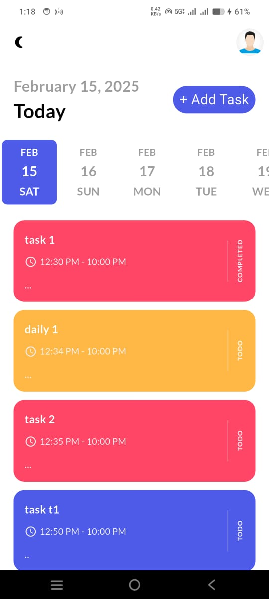
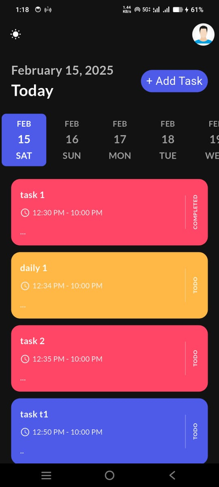

# DailyTrack - Task Management App

DailyTrack is a **task management app** designed to help you organize your daily tasks, set reminders, and track your progress. With support for **recurring tasks** (daily, weekly, monthly), **notifications**, and **light/dark themes**, DailyTrack ensures you stay on top of your schedule.

---

## 📌 Features

### ✅ Task Management
- Add, edit, and delete tasks.
- Mark tasks as completed.
- Organize tasks by date and time.

### 🔄 Recurring Tasks
- Set tasks to repeat **daily**, **weekly**, or **monthly**.
- Receive notifications for recurring tasks.

### 🔔 Notifications
- Schedule reminders for tasks.
- Get notified for **one-time**, **daily**, **weekly**, and **monthly** tasks.

### 🎨 Theme Support
- Light and dark themes.
- Dynamic theme switching with persistence using **GetStorage**.

### 🏆 User-Friendly UI
- Clean and intuitive interface.
- Smooth animations for task lists using **flutter_staggered_animations**.

---

## 📸 Screenshots

| Light Theme | Dark Theme |
|-------------|------------|
|  |  |

---

## 🏗️ Technologies Used

- **Flutter**: A UI toolkit for building natively compiled applications.
- **GetX**: For state management, dependency injection, and navigation.
- **GetStorage**: For lightweight and persistent local storage.
- **Awesome Notifications**: For scheduling and displaying notifications.
- **Date Picker Timeline**: For selecting dates in a timeline view.
- **Intl**: For date and time formatting.

---

## 🚀 Getting Started

### 📌 Prerequisites
- Flutter SDK installed on your machine.
- Android Studio or VS Code with Flutter and Dart plugins.

### 📥 Installation
1. Clone the repository:
   ```sh
   git clone https://github.com/DevvUdit01/DailyTrack.git
   ```
2. Navigate to the project directory:
   ```sh
   cd DailyTrack
   ```
3. Install dependencies:
   ```sh
   flutter pub get
   ```
4. Run the app:
   ```sh
   flutter run
   ```

---

## 🛠️ Usage

### 📌 Adding a Task
1. Tap the **+ Add Task** button on the home screen.
2. Enter the task details (title, description, date, time, and repeat type).
3. Tap **Save** to add the task.

### ✏️ Editing a Task
1. Tap on a task in the task list.
2. Update the task details.
3. Tap **Save** to update the task.

### 🗑️ Deleting a Task
1. Tap on a task in the task list.
2. Tap the **Delete Task** button in the bottom sheet.

### ✅ Marking a Task as Completed
1. Tap on a task in the task list.
2. Tap the **Task Completed** button in the bottom sheet.

### 🎨 Switching Themes
1. Tap the theme toggle button in the app bar.
2. The app will switch between light and dark themes.

---

## 📂 Code Structure

```
lib/
├── core/
│   ├── model/
│   │   └── task.dart            # Task model
├── controllers/
│   └── task_controller.dart     # Task logic and state management
├── pages/
│   ├── home_page.dart           # Main screen with task list
│   ├── add_task_page.dart       # Screen for adding/editing tasks
│   └── notified_page.dart       # Screen for notification details
├── services/
│   ├── theme_service.dart       # Theme management
│   └── notification_service.dart # Notification logic
├── utils/
│   ├── button.dart              # Custom button widget
│   ├── task_tile.dart           # Task list item widget
│   └── themes.dart              # App themes and styles
└── main.dart                    # App entry point
```

---

## 🔑 Key Components

### 📝 Task Model (`task.dart`)
- Defines the structure of a task, including:
  - `id`, `title`, `note`, `date`, `startTime`, `repeat`, and `isCompleted`.

### 🎯 Task Controller (`task_controller.dart`)
- Manages task-related logic, including:
  - Adding, updating, deleting, and marking tasks as completed.
  - Fetching tasks from storage.

### 🎨 Theme Service (`theme_service.dart`)
- Manages light/dark theme switching.
- Uses **GetStorage** to persist the theme preference.

### 🔔 Notification Service (`notification_service.dart`)
- Handles scheduling and displaying notifications using **Awesome Notifications**.
- Supports **one-time**, **daily**, **weekly**, and **monthly** notifications.

### 📱 UI Components
- **Home Page (`home_page.dart`)**: Displays the task list and date picker.
- **Add Task Page (`add_task_page.dart`)**: Allows users to add or edit tasks.
- **Notified Page (`notified_page.dart`)**: Displays notification details.

---

## 📦 Dependencies

- **GetX**: For state management and navigation.
- **GetStorage**: For lightweight local storage.
- **Awesome Notifications**: For scheduling and displaying notifications.
- **Date Picker Timeline**: For selecting dates in a timeline view.
- **Intl**: For date and time formatting.
- **Flutter Staggered Animations**: For animating task lists.

---

## 💡 Contributing

Contributions are welcome! If you'd like to contribute, please follow these steps:

1. Fork the repository.
2. Create a new branch:
   ```sh
   git checkout -b feature/YourFeatureName
   ```
3. Commit your changes:
   ```sh
   git commit -m 'Add some feature'
   ```
4. Push to the branch:
   ```sh
   git push origin feature/YourFeatureName
   ```
5. Open a pull request.

---

## 📜 License

This project is licensed under the **MIT License**. See the [LICENSE](LICENSE) file for details.

---

## 🙌 Acknowledgments

- Thanks to the **Flutter community** for their amazing packages and support.
- Special thanks to the creators of **GetX, GetStorage, and Awesome Notifications** for their excellent libraries.

---

## 📩 Contact

If you have any questions or feedback, feel free to reach out:

📧 **Email:** devv.udit@gmail.com  
🐙 **GitHub:** [DevvUdit01](https://github.com/DevvUdit01)

Enjoy using **DailyTrack**! 🚀

